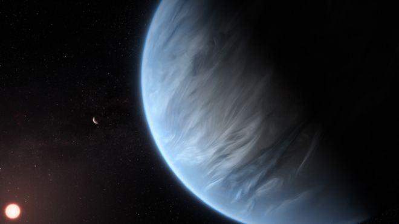

```{r setup, include=FALSE}
knitr::opts_chunk$set(echo = FALSE)
```




## Vocabulary 

| Words from the text | Synonym/explanation in English | French translation |
|--|--|--|
| Benign | Harmless (in this case)  | Bénin |
| Filtered through | To get sieved    | Être filtré par |
| Dispute the claim | To challenge a finding | Contester une affirmation |
| Long haul | A long journey | Un long voyage  |
| Survey | A sampling of elements used to indicate what a complete analysis might reveal | Une étude   |
| Perhaps | Possibly | Peut-être  |

## Analysis table 

| Researchers | Angelos Tsiaras, Ingo P. Waldmann, Giovanna Tinetti, Jonathan Tennyson & Sergey N. Yurchenko |
|-|-|
| Date and paper of publication | 25 September 2019, in Nature Astronomy |
| General topic |Discovery of an exoplanet with an atmosphere containing water |
| Procedure |The team used the Hubble telescope. When the planet passes in front of its star (between its star and the Earth), the light passing through the atmosphere is reflected. The reflection depends on the chemical compounds in the atmosphere. |
| Conclusion | The team discovered that there was water in the atmosphere of this planet |
| Remaining questions | Maybe this planet houses life? Maybe this planet is too massive for it to happen? Maybe this planet is, in fact, a gas planet, like a small Neptune, instead of a rocky planet like the Earth of Mars? |
| Word count | 891 |

Source : <https://www.bbc.com/news/science-environment-49648746>, September 12, 2019
