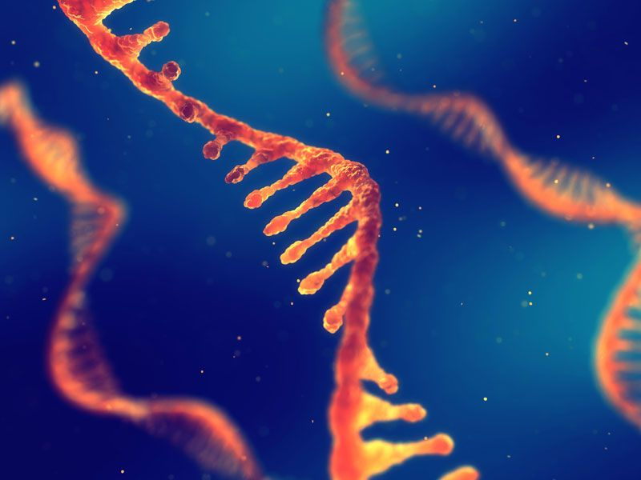

```{r setup, include=FALSE}
knitr::opts_chunk$set(echo = FALSE)
```


## I - SOURCE OF THE ARTICLE WITH PUBLICATION DATE AND WORD COUNT:

Source : <https://www.nature.com/articles/d41586-019-02622-4>, October 4 2019

Word count: 508

## II - VOCABULARY:

| Words from the text | Synonym/explanation in English | French translation |
|--|--|--|
|blanketed|Cover completely with a thick layer of something|Couvert|
|(Chemical) pathway|Chain of chemical reactions|Voie chimique|
|Marvelously|Wonderfully|Merveilleusement|
|Hindsight|Understanding of a situation or event only after it has happened or developed|Recul|

## III - ANALYSIS TABLE ABOUT THE STUDY:

| Researchers? | Thomas Carell & al |
|-|-|
| Published in? When (if mentioned)? | Science, October 3, 2019 |
| General topic | RNA synthesis, origin of life |
| Procedure/what was examined | The team made some experiment and tried to find a chemical pathway for RNA synthesis, which is a candidate to explain how life may have appeared. They first found a way for the nucleobases to appear, but the pathway for A and G, and for U and C, are incompatible. |
| Conclusion/discovery | Carrel's team successfully found a way to create all nucleobases through a seemingly natural chemical pathway. |
| Remaining questions | RNA isn't only nucleobases, but also sugar (ribose). How did it appear? Some researchers doubt it might be the best explanation as to how did life appear. |


