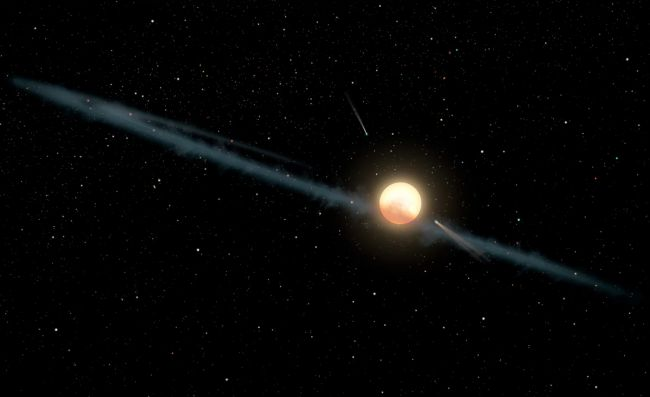

```{r setup, include=FALSE}
knitr::opts_chunk$set(echo = FALSE)
```


Credit: (Image: © NASA/JPL-Caltech)

## I - SOURCE OF THE ARTICLE WITH PUBLICATION DATE AND WORD COUNT:

Source : <https://www.space.com/alien-megastructure-mysteriously-dimming-stars.html>, September 19, 2019
Word count: 792

## II - VOCABULARY:

| Words from the text | Synonym/explanation in English | French translation |
|--|--|--|
|bouts|A short period of intense activity of a specified kind|Crise, accès de|
|bewildering|Causing (someone) to become perplexed and confused|Déroutant, déconcertant|
|flickering|(of light or a source of light) shine unsteadily; vary rapidly in brightness|(Lumière) vacillante|
|substantial|Of considerable importance, size, or worth|Substantiel|
|prosaic|Having the style or diction of prose; lacking poetic beauty|Prosaïque|
|elusive|Difficult to find, catch, or achieve|Insaisissable|
|to comb|To search carefully and systematically|Fouiller|

## III - ANALYSIS TABLE ABOUT THE STUDY:

| Researchers? | Tabetha "Tabby" Boyajian, Edward Schmidt |
|-|-|
| Published in? When (if mentioned)? | Space.com, September 19, 2019
The Astrophysical Journal Letters, July 18,2019 |
| General topic | Possible alien megastructures |
| Procedure/what was examined | In 2015, a team led by Tabetha "Tabby" Boyajian studied the data sent from the space telescope "Kepler", the light spectrum of a multitude of stars. They discovered that the light of one of these stars mysteriously dimmed, up to 22%. They suggested it might be because of an alien structure, called a "Dyson sphere", that could encircle an entire star system to get as much energy from it as possible. Another team led by Edward Schmidt studied the spectrum of 14 million objects with varying brightness.|
| Conclusion/discovery |  Schmidt found 21 more stars that add the same kind of dimming Boyajian's star had. Some of these are "slow dippers" similar to Boyajian's star, but some are "rapid dippers", "that showed even more extreme variability in their dimming rates".|
| Remaining questions | Why are some stars "rapid dippers"? Are these dips caused by alien structures, or something else? How common are these stars? |

