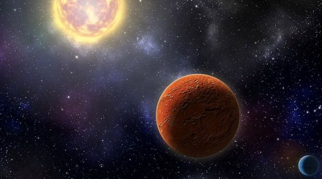

## I - SOURCE OF THE ARTICLE WITH PUBLICATION DATE AND WORD COUNT:

Source : <https://www.space.com/breakthrough-listen-nasa-tess-seti-search.html>, Octobre 23, 2019

Word count: 655

## II - VOCABULARY:

| Words from the text | Synonym/explanation in English | French translation |
|--|--|--|
| Endeavors | An attempt to achieve a goal | tentative |
| Oddities | A strange or peculiar person, thing, or trait | Bizarrerie, curiosité |
| Dimming | Make or become less bright or distinct | Atténuation |

## III - ANALYSIS TABLE ABOUT THE STUDY:

| Researchers? | Pete Worden, Sara Seager, Andrew Siemion |
|-|-|
| Published in? When (if mentioned)? | Space.com, Octobre 23, 2019 |
| General topic | Discover alien structures using a probe |
| Procedure/what was examined | NASA launched a space probe in april 18 "on a mission to hunt for alien planets circling bright, relatively nearby stars", using the transit method (the probe "looks for slight dips in star brightness caused when an orbiting planet crosses the star's face") |
| Conclusion/discovery | To this date (Oct 23), the probe has discovered "1,000 "objects of interest," 29 of which are confirmed alien planets." |
| Remaining questions | The team has to be careful not to confuse possible alien megastructures, and natural phenomena, like an asteroid field for example. |

