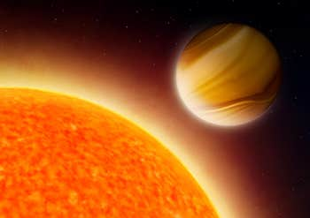

```{r setup, include=FALSE}
knitr::opts_chunk$set(echo = FALSE)
```



## I - SOURCE OF THE ARTICLE WITH PUBLICATION DATE AND WORD COUNT:

Source : <https://www.independent.co.uk/life-style/gadgets-and-tech/news/alien-planet-water-extraterrestrial-life-exoplanet-space-a9241811.html>, December 11, 2019
Word count: 536

## II - VOCABULARY:

| Words from the text | Synonym/explanation in English | French translation |
|--|--|--|
|to conduct|to organize and carry out | mener/conduire (une expérience par exemple)|
|to gather| to ome together; assemble or accumulate | rassembler |
|prevalence| commonness | prévalence, fréquence|
|array|an impressive display or range of a particular type of thing| tableau/assemblée/groupe|

## III - ANALYSIS TABLE ABOUT THE STUDY:

| Researchers? | Nikku Madhusudhan, Luis Welbanks |
|-|-|
| Published in? When (if mentioned)? | The Independent, December 11, 2019 |
| General topic | Water on exoplanets |
| Procedure/what was examined | Using a large array of telescopes (from the ground and space), a group of scientists analyzed the atmosphere of many gas giants outside of our solar system, with the hope of finding water vapor.|
| Conclusion/discovery | The team successfully analyzed the atmosphere of 19 gas giants. Out of these, 14 turned out having water in their atmosphere. It turns out water might be even more common in the universe than we previously thought.  |
| Remaining questions | The planets analyzed were gas giants, between 10 and 600 times the size of the earth. They still have to do the same experiments with the much smaller rocky planets (See article 1). It is also important to take into account how much this discovery will change our understanding of how did these planets formed. |

