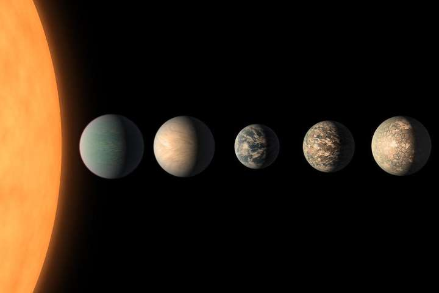

```{r setup, include=FALSE}
knitr::opts_chunk$set(echo = FALSE)
```



## I - SOURCE OF THE ARTICLE WITH PUBLICATION DATE AND WORD COUNT:

Source : <https://www.independent.co.uk/life-style/gadgets-and-tech/news/alien-life-other-planets-worlds-exoplanets-earth-science-space-a9075316.html>, August 22, 2019
Word count: 773

## II - VOCABULARY:

| Words from the text | Synonym/explanation in English | French translation |
|--|--|--|
|flourishing|thriving|florissant|
|upwelling|a liquid rising up|remontée|

## III - ANALYSIS TABLE ABOUT THE STUDY:

| Researchers? | Dr Stephanie Olson |
|-|-|
| Published in? When (if mentioned)? | The Independent, August 22, 2019 |
| General topic | Habitability of exoplanets, due to ocean upwelling, using NASA modelization softwares |
| Procedure/what was examined | Scientists used observations and models (NASA softwares) to understand how the atmosphere and oceans of exoplanets could work and impact the apparition and sustainability of life |
| Conclusion/discovery | Using models and observations, scientists concluded that some planets could be better suited to support life than the earth. For example, their oceans could be more active, bringing nutrients from the oceanic floor to the sunlit surface. |
| Remaining questions | Now that the theory is here, there need more and better observations. Some telescopes will be able to analyze the atmosphere of rocky planets in the foreseeable future, and maybe even their oceans. As a scientist from the GIT put it, "our understanding of oceans beyond our solar system is currently very rudimentary". |

