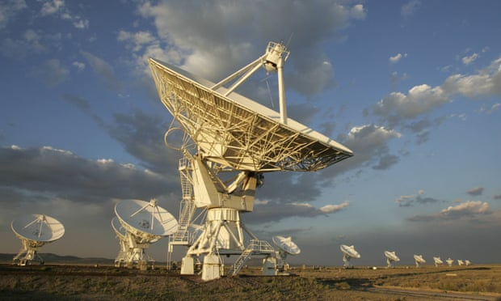

```{r setup, include=FALSE}
knitr::opts_chunk$set(echo = FALSE)
```


## I - SOURCE OF THE ARTICLE WITH PUBLICATION DATE AND WORD COUNT:

Source : <https://www.theguardian.com/science/2020/feb/15/astronomers-to-sweep-entire-sky-for-signs-of-extraterrestrial-life>, February 15, 2020
Word count: 856

## II - VOCABULARY:

| Words from the text | Synonym/explanation in English | French translation |
|--|--|--|
|arrangement|plans or preparations for a future event|organisation|
|squawks|make a loud, harsh noise|hurlement|
|trustee|an individual person or member of a board given control or powers of administration of property in trust with a legal obligation to administer it solely for the purposes specified|curateur|
|to sketch out|to outline|esquisser|
|fringes|in this case:rare, uncommon|frange (mais ici: rare)|
|to be ironed out|in this case: to solve (issues), usually, to use an iron on a piece of clothing | repasser (mais ici: résoudre un problème) |


## III - ANALYSIS TABLE ABOUT THE STUDY:

| Researchers? | Andrew Siemion, Tony Beasley, et al from the Seti Institute and the Very Large Array |
|-|-|
| Published in? When (if mentioned)? | The Guardian,  February 15, 2020|
| General topic | Upgrading telescopes to scan the entire sky to look if some habitables planets carries life forms. |
| Procedure/what was examined | A new telescope will be built to look the entire sky all the time, allowing to analyse the atmosphere of planets to search traces of gases produced by living organisms thanks to the future James Webb Telescope, an observation satellite. |
| Conclusion/discovery | The ground satellite have yet to be built and the James Webb Telescope has yet to be launched. They will start by looking at planets from the Trappist-1 system, 3 of which being in the habitable zone of the system. |
| Remaining questions | Some scientists like Stephen Hawking believe it would be a bad idea to contact them. |

